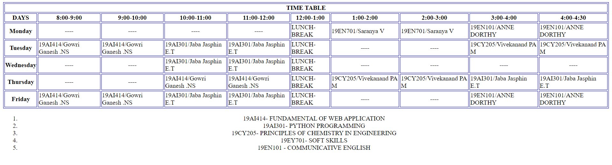

# Experiment_Time_Table

## AIM
To Write a html webpage page to display your timetable.

# ALGORITHM
### STEP 1
create a simple table using table tag
### STEP 2
Add header row using th tag
### STEP 3
Add your timetable
### STEP 4
Execute the program

# CODE
```python
<!DOCTYPE html>
<html lang="en">
<head>
    <meta charset="UTF-8">
    <meta http-equiv="X-UA-Compatible" content="IE=edge">
    <meta name="viewport" content="width=device-width, initial-scale=1.0">
    <title>time table</title>
</head>
<body>
    <TABLE BORDER="1" cellspacing="3" bordercolor="blue"> 
        <TR> 
            <TH class="abc" colspan="10">TIME TABLE</TH>
        </TR>
        
    <tr>
        <th>DAYS</th>
        <th>8:00-9:00</th>
        <th>9:00-10:00</th>
        <th>10:00-11:00</th>
        <th>11:00-12:00</th>
        <th>12:00-1:00</th>
        <th>1:00-2:00</th>
        <TH>2:00-3:00</TH>
        <th>3:00-4:00</th>
        <th>4:00-4:30</th>
    </tr>
    <tr>
        <th>Monday</th>
         <th>----</th>
         <th>----</th>
         <th>----</th>
         <th>----</th>
        <td>LUNCH-BREAK</td>
        <td>19EN701/Saranya V</td>
        <td>19EN701/Saranya V</td>
        <td>19EN101/ANNE DORTHY</td>
        <td>19EN101/ANNE DORTHY</td>
      </tr>
      <tr>
        <th>Tuesday</th>
        <td>19AI414/Gowri Ganesh .NS</td>
        <td>19AI414/Gowri Ganesh .NS</td>
        <td>19AI301/Jaba Jasphin E.T</td>
        <td>19AI301/Jaba Jasphin E.T</td>
        <td>LUNCH-BREAK</td>
         <th>----</th>
         <th>----</th>
        <td>19CY205/Vivekanand PA M</td>
        <td>19CY205/Vivekanand PA M</td>

      </tr>
      <tr>
        <th>Wednesday</th>
        <th>----</th>
        <th>----</th>
        <td>19AI301/Jaba Jasphin E.T</td>
        <td>19AI301/Jaba Jasphin E.T</td>
        <td>LUNCH-BREAK</th>
        <th>----</th>
        <th>----</th>
        <th>----</th>
        <th>----</th>
        
      </tr>
      <tr>
        <th>Thursday</th>
        <th>----</th>
        <th>----</th>
        <td>19AI414/Gowri Ganesh .NS</td>
        <td>19AI414/Gowri Ganesh .NS</td>
        <td>LUNCH-BREAK</td>
        <td>19CY205/Vivekanand PA M</td>
        <td>19CY205/Vivekanand PA M</td>
        <td>19AI301/Jaba Jasphin E.T</td>
        <td>19AI301/Jaba Jasphin E.T</td>   
      </tr>
      <tr>
        <th>Friday</th>
        <td>19AI414/Gowri Ganesh .NS</td>
        <td>19AI414/Gowri Ganesh .NS</td>
        <td>19AI301/Jaba Jasphin E.T</td>
        <td>19AI301/Jaba Jasphin E.T</td>   
        <td>LUNCH-BREAK</td>
        <th>----</th>
        <th>----</th>
        <td>19EN101/ANNE DORTHY</td>
        <td>19EN101/ANNE DORTHY</td>
        </tr>
    </table>
        <ol>
          <center>
            <LI>19AI414- FUNDAMENTAL OF WEB APPLICATION</LI>
            <LI>19AI301- PYTHON PROGRAMMING</LI>
            <LI>19CY205- PRINCIPLES OF CHEMISTRY IN ENGINEERING</LI>
            <LI>19EY701- SOFT SKILLS</LI>
            <LI>19EN101 - COMMUNICATIVE ENGLISH</LI>
          </center>
       
        </ol>
    
</body>
</html>
```
## OUPUT


## Result
Timetable is sucessfully created.